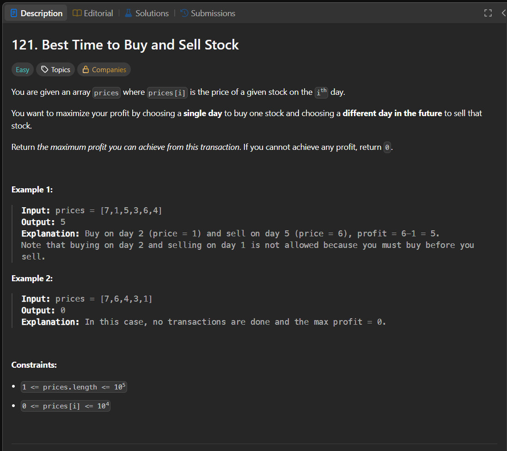

Паттерн: running minimum

Если нужно найти максимальную разницу между текущим элементом и одним из предыдущих,
часто достаточно хранить лучший минимум слева.

В этой задаче нельзя продать акцию раньше покупки, поэтому для каждого дня продажи
нужно знать минимальную цену покупки до этого дня.

Алгоритм:

1. храним минимальную цену, которую видели раньше
2. проходим по ценам слева направо
3. считаем прибыль, если продать в текущий день
4. обновляем максимальную прибыль
5. если текущая цена меньше минимальной, обновляем минимальную цену

Сложность:

Time: O(n)
Space: O(1)

