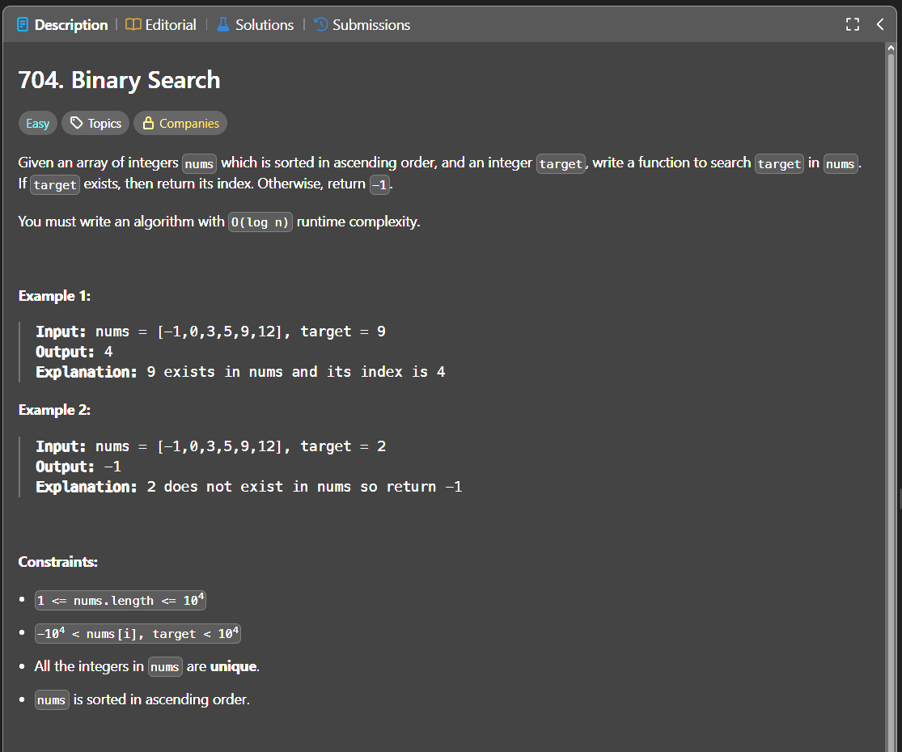

Паттерн: binary search

Если массив отсортирован и нужно найти конкретное значение,
можно не проходить весь массив, а каждый раз отбрасывать половину.

Идея:

Храним две границы поиска: `left` и `right`.
На каждом шаге берём середину массива и сравниваем её с `target`.

Если значение в середине меньше `target`, значит искать нужно справа.
Если значение в середине больше `target`, значит искать нужно слева.
Если значение равно `target`, возвращаем индекс.

Алгоритм:

1. ставим `left` на начало массива
2. ставим `right` на конец массива
3. пока `left <= right`, считаем середину `mid`
4. если `nums[mid] == target`, возвращаем `mid`
5. если `nums[mid] < target`, двигаем `left` вправо
6. если `nums[mid] > target`, двигаем `right` влево
7. если границы пересеклись, значит элемента в массиве нет

Важно:

Функция должна вернуть индекс элемента в исходном массиве, а не само значение.

При изменении среза можно потерять исходные индексы, поэтому удобнее хранить границы `left` и `right`.

Сложность:

Time: O(log n)
Space: O(1)

