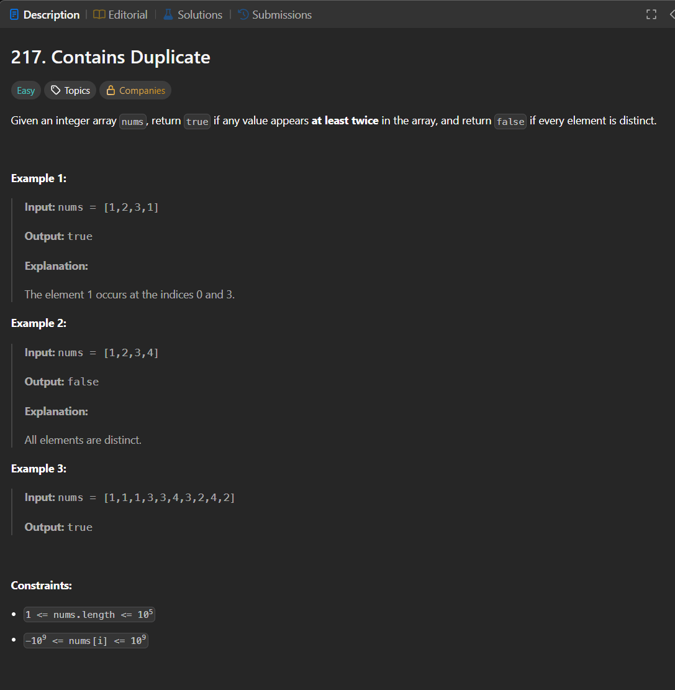

Паттерн: hash set

Если нужно проверить, встречался ли элемент раньше,
можно хранить уже просмотренные значения в `map`.

В Go для множества удобно использовать `map[int]struct{}`.

Алгоритм:

1. создаём `map` для просмотренных чисел
2. проходим по массиву
3. если число уже есть в `map`, значит дубликат найден
4. если числа нет, добавляем его в `map`
5. если дошли до конца, дубликатов нет

Сложность:

Time: O(n)
Space: O(n)

