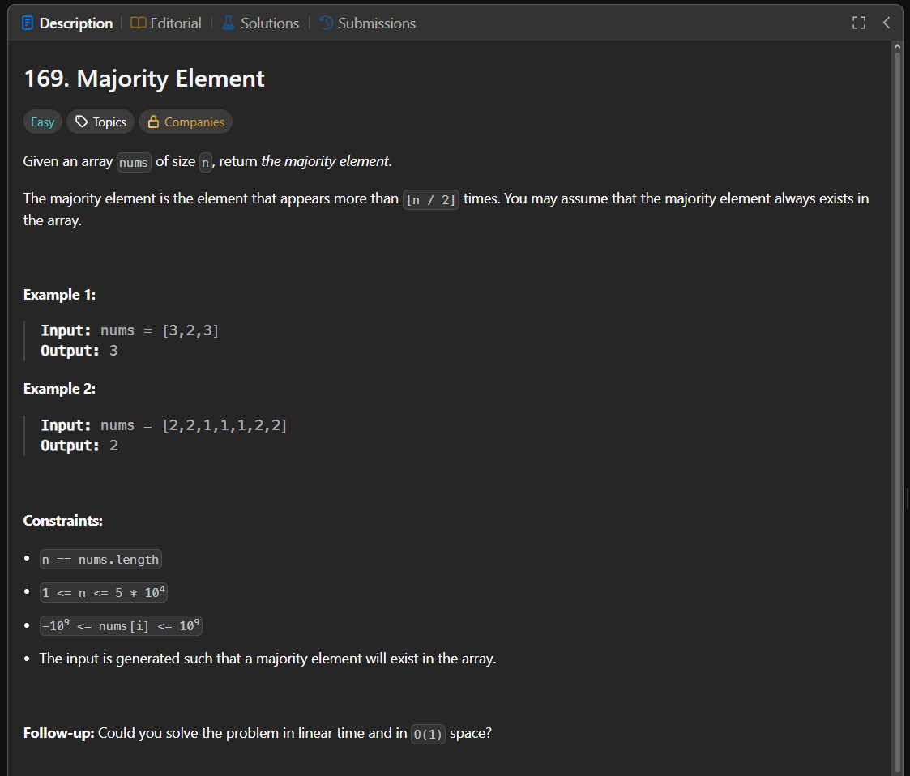

Паттерн: Boyer-Moore majority vote

Majority element в этой задаче это не просто самый частый элемент.
Это элемент, который встречается строго больше len(nums) / 2 раз.

По условию LeetCode такой элемент всегда существует.

Идея алгоритма:

Если один элемент встречается больше половины массива,
то все остальные элементы вместе встречаются реже, чем он.

Поэтому можно как бы "погашать" разные элементы друг другом.
В конце останется кандидат на majority element.

Алгоритм:

храним candidate и count
если count == 0, текущий элемент становится новым кандидатом
если текущий элемент равен кандидату, увеличиваем count
если текущий элемент отличается от кандидата, уменьшаем count
после прохода candidate будет majority element

Важно:

Boyer-Moore majority vote работает без дополнительной проверки только если majority element гарантированно существует.

Если такой гарантии нет, нужен второй проход по массиву, чтобы проверить,
что кандидат действительно встречается больше len(nums) / 2 раз.

Сложность:

Time: O(n)
Space: O(1)

