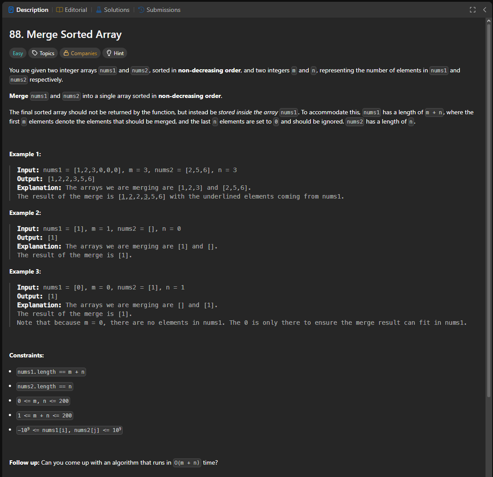

Паттерн: merge from the end

Если два массива уже отсортированы, не нужно объединять их и сортировать заново.

В этой задаче в конце nums1 уже есть свободное место под элементы из nums2.
Поэтому удобно заполнять nums1 с конца, чтобы не затереть ещё не обработанные элементы.

Алгоритм:

ставим указатель на последний реальный элемент nums1
ставим указатель на последний элемент nums2
ставим указатель на последнюю позицию nums1
сравниваем элементы из nums1 и nums2
больший элемент записываем в конец nums1
двигаем соответствующий указатель назад
продолжаем, пока не перенесём все элементы из nums2

Важно:

Если в nums1 остались элементы, их можно не трогать.
Они уже находятся на правильных местах.

Если в nums2 остались элементы, их нужно дописать в начало nums1.

Сложность:

Time: O(m + n)
Space: O(1)

