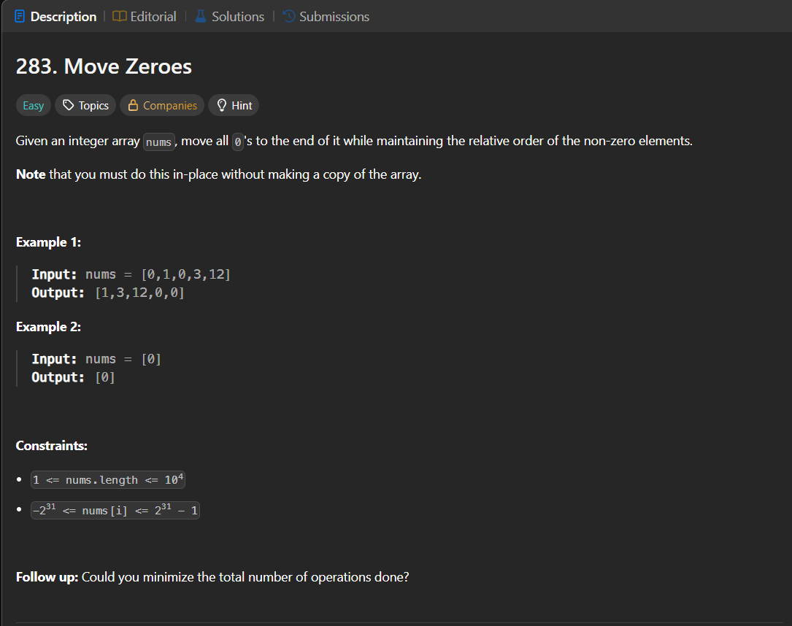

Паттерн: write pointer

Если нужно изменить массив in-place и сохранить порядок элементов,
часто не надо удалять элементы из середины.

Вместо этого:

1. держим позицию для следующего подходящего элемента
2. проходим по массиву
3. все нужные элементы записываем в начало
4. остаток заполняем тем, что должно быть в конце

