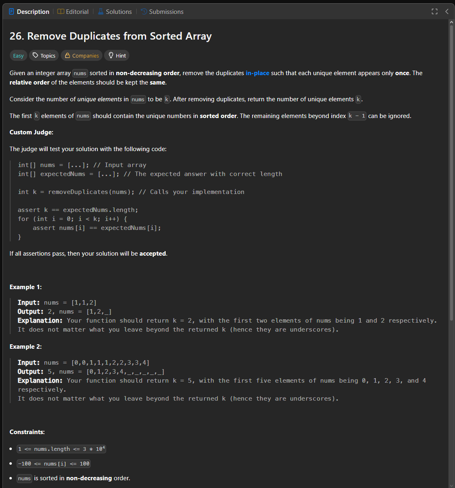

Паттерн: write pointer

Если массив отсортирован и нужно удалить дубликаты in-place,
часто не нужно реально удалять элементы из середины.

Вместо этого можно перезаписать начало массива уникальными значениями.

Алгоритм:

1. держим позицию для следующего уникального элемента
2. проходим по массиву слева направо
3. если это первый элемент или он отличается от последнего записанного
4. записываем его в текущую позицию
5. возвращаем количество записанных уникальных элементов

Важно:

Функция возвращает число уникальных элементов `k`.
LeetCode проверяет только первые `k` элементов массива.
Остальные элементы после `k - 1` могут быть любыми.

Сложность:

Time: O(n)
Space: O(1)

