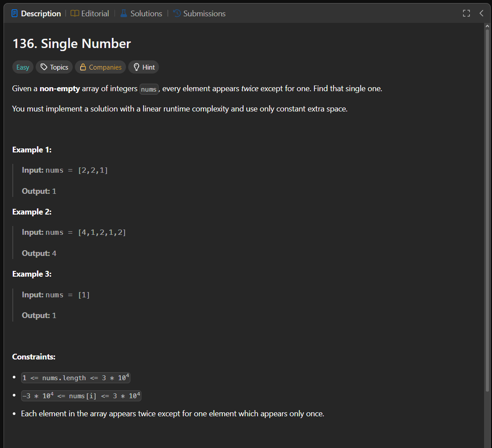

Паттерн: XOR

Если по условию все числа встречаются два раза, кроме одного,
можно использовать побитовую операцию XOR.

Главные свойства XOR:

1. одинаковые числа уничтожают друг друга: `a ^ a = 0`
2. число с нулём остаётся самим собой: `a ^ 0 = a`
3. порядок операций не важен

Поэтому можно пройти по массиву и накопить XOR всех элементов.

Пример:

`[4, 1, 2, 1, 2]`

Можно представить так:

`4 ^ 1 ^ 2 ^ 1 ^ 2`

Одинаковые элементы дают ноль:

`4 ^ (1 ^ 1) ^ (2 ^ 2)`

Остаётся:

`4 ^ 0 ^ 0 = 4`

Алгоритм:

1. создаём переменную `result` со значением `0`
2. проходим по всем числам
3. применяем XOR к `result` и текущему числу
4. после прохода в `result` останется число без пары

Важно:

Эту задачу можно решить через `map`, подсчитав количество каждого числа.
Но такое решение использует дополнительную память.

Сложность оптимального решения:

Time: O(n)
Space: O(1)

