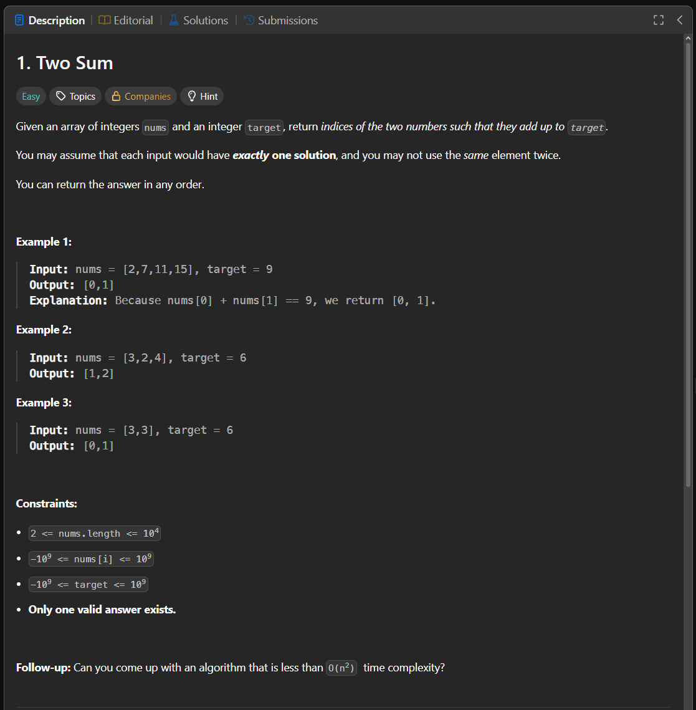

Паттерн: hash map

Если нужно быстро проверить, встречалось ли уже нужное значение,
часто можно использовать `map`.

Вместо полного перебора всех пар:

1. проходим по массиву один раз
2. для каждого числа считаем, какое второе число нужно до `target`
3. проверяем, есть ли это число в `map`
4. если есть, возвращаем индексы
5. если нет, сохраняем текущее число и его индекс

Сложность:

Time: O(n)
Space: O(n)

