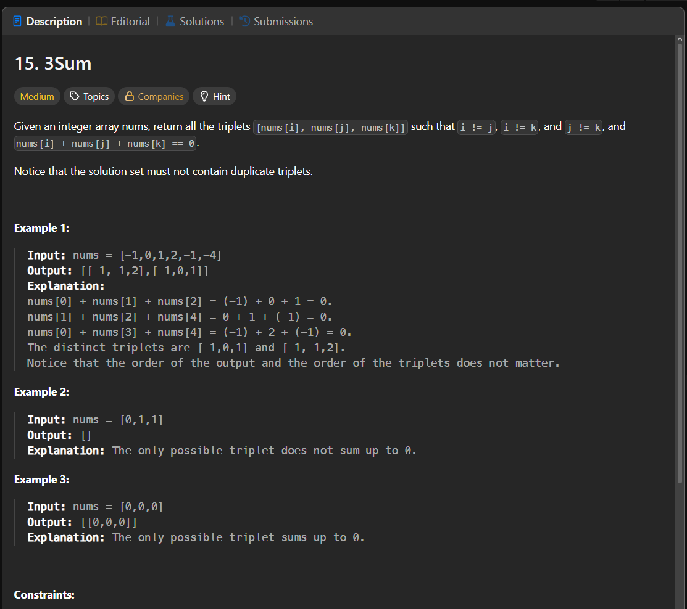

Паттерн: sorting + two pointers

В этой задаче нужно найти все уникальные тройки чисел,
сумма которых равна `0`.

Идея:

Фиксируем одно число `nums[i]`, а для двух остальных чисел ищем пару справа от него.

Если:

`a + b + c = 0`

то после выбора первого числа `a` нужно найти два числа:

`b + c = -a`

После сортировки массива пару можно искать через два указателя.

Алгоритм:

1. сортируем массив
2. проходим по массиву и фиксируем первое число тройки
3. если текущее число такое же, как предыдущее, пропускаем его
4. ставим `left` сразу после текущего индекса
5. ставим `right` в конец массива
6. считаем сумму `nums[i] + nums[left] + nums[right]`
7. если сумма равна `0`, добавляем тройку в результат
8. если сумма меньше `0`, двигаем `left` вправо
9. если сумма больше `0`, двигаем `right` влево
10. после найденной тройки пропускаем дубликаты для `left` и `right`

Зачем нужна сортировка:

Сортировка позволяет понимать, куда двигать указатели.

Если сумма слишком маленькая, нужно увеличить её, поэтому двигаем `left` вправо.
Если сумма слишком большая, нужно уменьшить её, поэтому двигаем `right` влево.

Также сортировка помогает пропускать одинаковые значения и не добавлять одинаковые тройки несколько раз.

Важно:

`3Sum` можно воспринимать как развитие `Two Sum`.

Сначала фиксируем одно число, а потом ищем два оставшихся числа через two pointers.

Дубликаты нужно пропускать в двух местах:

1. при выборе первого числа `nums[i]`
2. после того как нашли подходящую тройку

Сложность:

Time: O(n²)
Space: O(1), если не считать результат

Сортировка может использовать дополнительную память в зависимости от реализации.

