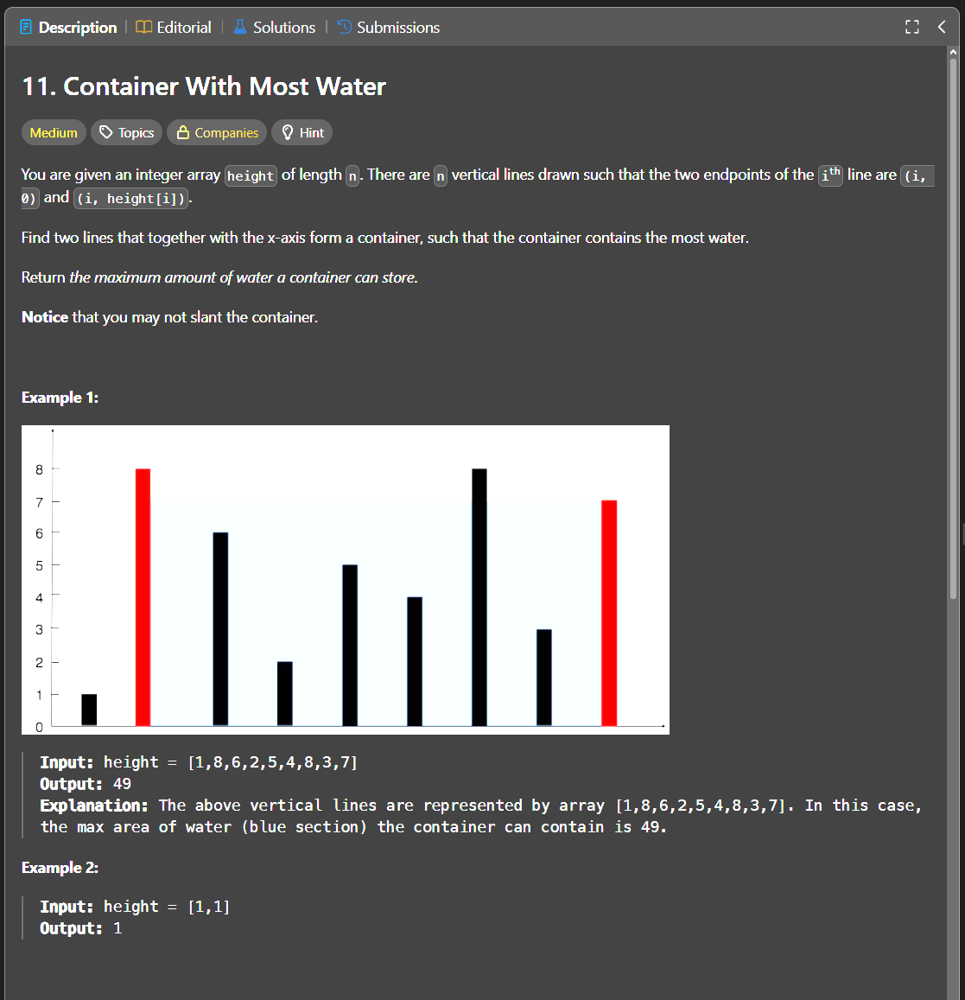

Паттерн: two pointers

В этой задаче нужно найти две грани, между которыми помещается максимум воды.

Площадь считается так:

`area = min(height[left], height[right]) * (right - left)`

То есть важны две вещи:

1. расстояние между гранями
2. меньшая из двух высот

Идея:

Начинаем с максимальной ширины: ставим один указатель в начало массива, второй в конец.

На каждом шаге считаем площадь и двигаем указатель с меньшей высотой.

Почему двигаем меньшую высоту:

Площадь всегда ограничена меньшей стенкой.
Если оставить меньшую стенку и двигать другую, ширина станет меньше, а ограничение по высоте останется тем же.
Поэтому улучшить результат можно только если попробовать найти более высокую стенку с этой стороны.

Алгоритм:

1. ставим `left` в начало массива
2. ставим `right` в конец массива
3. пока `left < right`, считаем текущую площадь
4. обновляем максимальную площадь
5. если `height[left] < height[right]`, двигаем `left`
6. иначе двигаем `right`
7. возвращаем максимальную найденную площадь

Важно:

Оптимальная пара граней не обязательно состоит из самых высоких линий.
Иногда более низкие, но далеко расположенные грани дают большую площадь.

Сложность:

Time: O(n)
Space: O(1)

