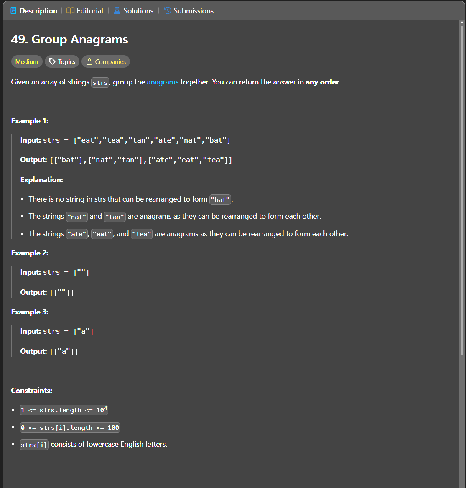

Паттерн: hash map + canonical key

В этой задаче нужно сгруппировать строки, которые являются анаграммами.

Анаграммы состоят из одинаковых букв, но в разном порядке.

Например:

`eat`, `tea`, `ate`

После сортировки букв все эти строки дают одинаковый ключ:

`aet`

Идея:

Для каждой строки создаём общий ключ.
Если две строки являются анаграммами, после сортировки букв у них будет одинаковый ключ.

Этот ключ используем в `map`, где:

`key = отсортированная строка`
`value = список исходных строк с таким ключом`

Пример:

`["eat", "tea", "tan", "ate", "nat", "bat"]`

После сортировки букв:

`eat -> aet`
`tea -> aet`
`ate -> aet`

`tan -> ant`
`nat -> ant`

`bat -> abt`

Map будет выглядеть так:

`aet -> ["eat", "tea", "ate"]`
`ant -> ["tan", "nat"]`
`abt -> ["bat"]`

Алгоритм:

1. создаём `map[string][]string`
2. проходим по всем строкам
3. разбиваем строку на символы
4. сортируем символы
5. собираем отсортированную строку обратно
6. используем её как ключ в `map`
7. добавляем исходную строку в группу по этому ключу
8. в конце возвращаем все группы из `map`

Важно:

Порядок групп в результате может отличаться, потому что `map` в Go не гарантирует порядок обхода.

Это нормально, потому что в задаче важна группировка анаграмм, а не порядок групп.

Сложность:

Пусть `n` это количество строк, а `m` это средняя длина строки.

Time: O(n _ m log m)
Space: O(n _ m)

