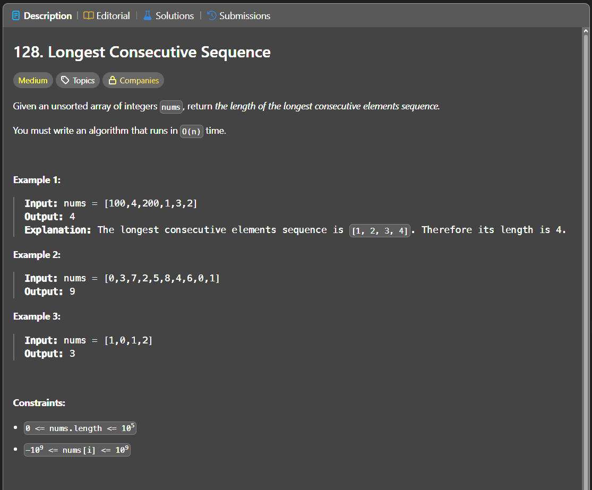

Паттерн: hash set + start of sequence

Если нужно найти самую длинную последовательность чисел подряд,
не обязательно сортировать массив.

Можно сложить все числа в `set`, а потом начинать подсчёт только с тех чисел,
которые являются началом последовательности.

Начало последовательности это число, для которого в `set` нет предыдущего числа `num - 1`.

Пример:

`[100, 4, 200, 1, 3, 2]`

Последовательность:

`1, 2, 3, 4`

Число `1` является началом, потому что `0` нет в `set`.

Числа `2`, `3`, `4` не являются началом, потому что перед ними есть предыдущие числа.

Алгоритм:

1. создаём `set` из всех чисел
2. проходим по уникальным числам из `set`
3. если `num - 1` есть в `set`, пропускаем число
4. если `num - 1` нет, это начало последовательности
5. идём вправо и проверяем `num + 1`, `num + 2` и так далее
6. считаем длину текущей последовательности
7. обновляем максимальную длину

Важно:

Внешний цикл лучше делать по `set`, а не по исходному массиву.
Так дубликаты не заставят повторно считать одну и ту же последовательность.

Хотя внутри есть вложенный цикл, итоговая сложность остаётся `O(n)`,
потому что последовательность считается только от её начала.

Сложность:

Time: O(n)
Space: O(n)

