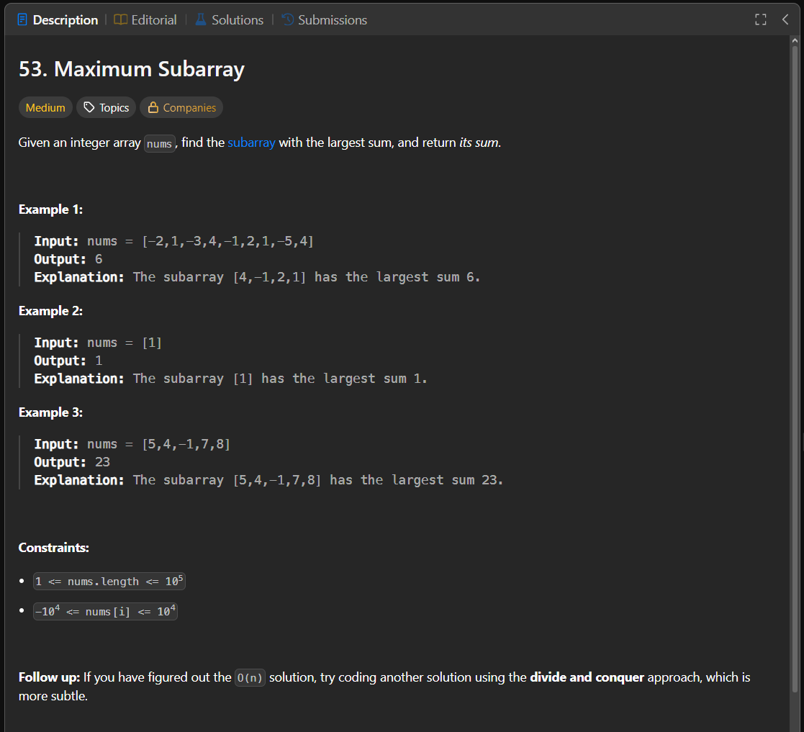

Паттерн: Kadane algorithm

В этой задаче нужно найти непрерывный подмассив с максимальной суммой.

Подмассив должен быть непрерывным и непустым.

Идея:

Идём по массиву слева направо и храним две суммы:

`current` — лучшая сумма подмассива, который заканчивается в текущей позиции
`maximum` — лучшая сумма, которую нашли вообще

На каждом элементе решаем:

1. продолжить текущий подмассив
2. или начать новый подмассив с текущего числа

Если `current` стал меньше нуля, продолжать его нет смысла.
Отрицательная сумма только ухудшит следующий подмассив.

Поэтому начинаем новый подмассив с текущего числа.

Алгоритм:

1. инициализируем `current` первым элементом массива
2. инициализируем `maximum` первым элементом массива
3. идём по массиву со второго элемента
4. если `current < 0`, начинаем новый подмассив с текущего числа
5. иначе добавляем текущее число к `current`
6. если `current > maximum`, обновляем `maximum`
7. возвращаем `maximum`

Пример:

`[-2, 1, -3, 4, -1, 2, 1, -5, 4]`

Максимальный подмассив:

`[4, -1, 2, 1]`

Сумма:

`4 + (-1) + 2 + 1 = 6`

Важно:

Нельзя начинать `current` и `maximum` с `0`.

Если все числа отрицательные, ответом должно быть самое большое отрицательное число.

Например:

`[-2, -1, -3]`

Ответ:

`-1`

Сложность:

Time: O(n)
Space: O(1)

