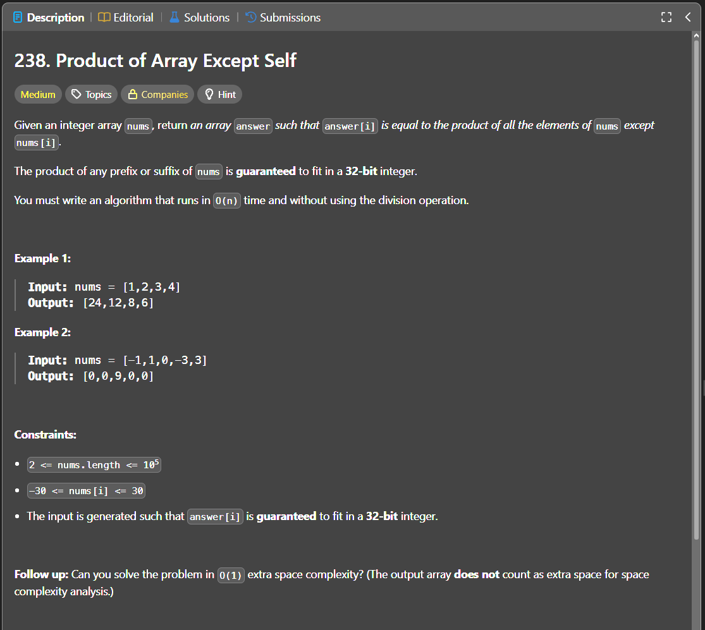

Паттерн: prefix / suffix

Если для каждого элемента нужно посчитать произведение всех остальных элементов,
не обязательно использовать деление.

Для каждого индекса ответ можно представить так:

`answer[i] = произведение всех элементов слева * произведение всех элементов справа`

Идея:

Сначала записываем в результат произведения всех элементов слева.
Потом идём справа налево и домножаем каждый элемент результата на произведение всех элементов справа.

Алгоритм:

1. создаём массив `result`
2. в первом проходе заполняем `result` prefix-произведениями
3. `result[i]` хранит произведение всех элементов слева от `i`
4. создаём переменную `suffix` со значением `1`
5. идём по массиву справа налево
6. домножаем `result[i]` на текущий `suffix`
7. обновляем `suffix`, умножая его на текущий элемент из `nums`

Важно:

`prefix[0] = 1`, потому что слева от первого элемента ничего нет.
`1` используется как нейтральное значение для умножения.

Так же справа от последнего элемента ничего нет, поэтому начальный `suffix = 1`.

Массив `nums` лучше не перезаписывать, потому что исходные значения ещё нужны для вычисления suffix-произведений.

Сложность:

Time: O(n)
Space: O(1), если не считать массив ответа

Если считать всю выделенную память вместе с возвращаемым массивом, то Space: O(n).

