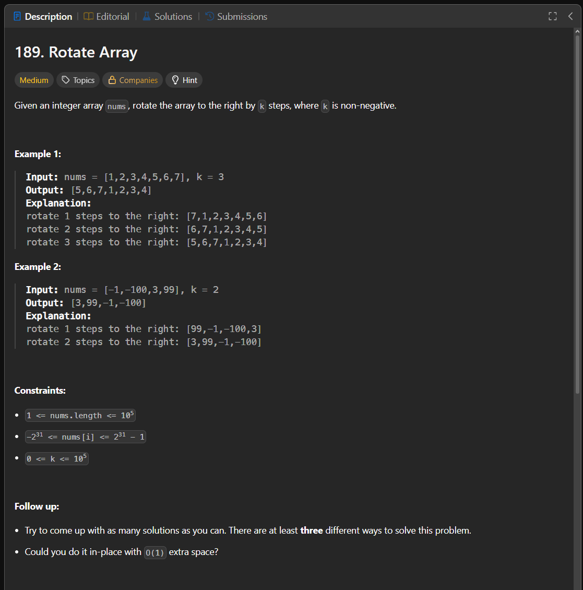

Паттерн: reverse parts + modulo

В этой задаче нужно сдвинуть массив вправо на `k` позиций.

Например:

`[1, 2, 3, 4, 5, 6, 7]`, `k = 3`

Результат:

`[5, 6, 7, 1, 2, 3, 4]`

Идея:

Последние `k` элементов должны перейти в начало массива,
а первая часть массива должна сдвинуться вправо.

Массив можно представить как две части:

`[1, 2, 3, 4] [5, 6, 7]`

Нужно получить:

`[5, 6, 7] [1, 2, 3, 4]`

Для этого можно использовать три разворота.

Алгоритм:

1. приводим `k` к размеру массива: `k = k % len(nums)`
2. разворачиваем весь массив
3. разворачиваем первые `k` элементов
4. разворачиваем оставшуюся часть массива

Пример:

Исходный массив:

`[1, 2, 3, 4, 5, 6, 7]`

После разворота всего массива:

`[7, 6, 5, 4, 3, 2, 1]`

После разворота первых `k` элементов:

`[5, 6, 7, 4, 3, 2, 1]`

После разворота оставшейся части:

`[5, 6, 7, 1, 2, 3, 4]`

Важно:

`k` может быть больше длины массива.

Например, если `len(nums) = 3`, а `k = 4`,
то сдвиг на `4` равен сдвигу на `1`:

`4 % 3 = 1`

Поэтому перед разворотами нужно сделать:

`k %= len(nums)`

Сложность:

Time: O(n)
Space: O(1)

