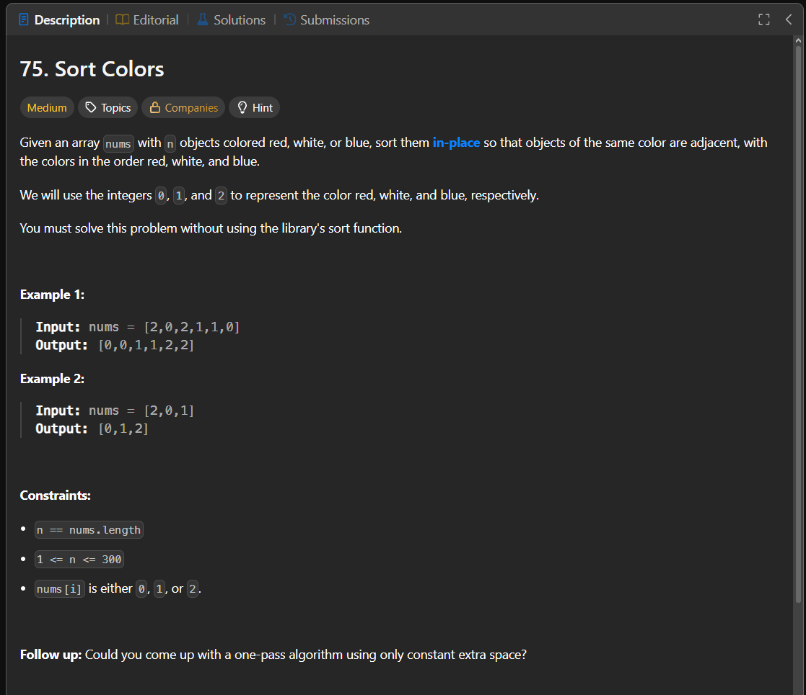

Паттерн: Dutch national flag

В этой задаче нужно отсортировать массив, в котором есть только три значения:

`0`, `1`, `2`

Нужно сделать это in-place, без дополнительного массива.

Идея:

Массив можно разделить на три зоны:

1. слева должны быть все `0`
2. в середине должны быть все `1`
3. справа должны быть все `2`

Для этого используем три указателя:

`left` показывает, куда поставить следующий `0`
`mid` показывает текущий элемент, который проверяем
`right` показывает, куда поставить следующий `2`

Алгоритм:

1. ставим `left` и `mid` в начало массива
2. ставим `right` в конец массива
3. пока `mid <= right`, проверяем `nums[mid]`
4. если `nums[mid] == 0`, меняем его с `nums[left]`, затем двигаем `left` и `mid`
5. если `nums[mid] == 1`, просто двигаем `mid`
6. если `nums[mid] == 2`, меняем его с `nums[right]`, затем двигаем `right`

Важно:

Когда встречаем `2`, указатель `mid` сразу не двигаем.

После обмена с правой частью в позицию `mid` может попасть любое значение: `0`, `1` или `2`.
Поэтому этот элемент нужно проверить ещё раз.

Когда встречаем `0`, можно двигать и `left`, и `mid`, потому что левая часть уже обработана.

Сложность:

Time: O(n)
Space: O(1)

