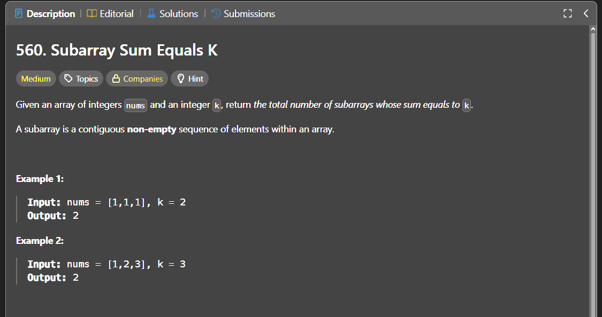

Паттерн: prefix sum + hash map

В этой задаче нужно посчитать количество непрерывных подмассивов,
сумма которых равна `k`.

Подмассив это непрерывный кусок массива.

Например:

`[1, 2, 3]`

Подмассивами будут:

`[1]`, `[2]`, `[3]`, `[1, 2]`, `[2, 3]`, `[1, 2, 3]`

Идея:

Используем prefix sum, то есть сумму всех элементов от начала массива до текущей позиции.

Если:

`currentSum - previousSum = k`

значит подмассив между `previousSum` и `currentSum` даёт сумму `k`.

Отсюда:

`previousSum = currentSum - k`

Поэтому на каждом шаге нужно проверить, сколько раз раньше встречалась prefix-сумма `currentSum - k`.

Алгоритм:

1. храним текущую сумму `currentSum`
2. храним ответ `answer`
3. в `map` храним количество уже встреченных prefix-сумм
4. заранее кладём `seenSums[0] = 1`, чтобы учитывать подмассивы от начала массива
5. идём по массиву слева направо
6. добавляем текущее число к `currentSum`
7. ищем `previousSum = currentSum - k`
8. добавляем к ответу `seenSums[previousSum]`
9. сохраняем текущую сумму: `seenSums[currentSum]++`

Важно:

`seenSums[previousSum]` это не количество уже найденных подмассивов.

Это количество возможных стартовых точек слева,
из которых можно получить новый подмассив с суммой `k`,
заканчивающийся в текущей позиции.

Поэтому строка:

`answer += seenSums[previousSum]`

означает:

добавить все новые подмассивы, которые заканчиваются на текущем элементе.

Пример:

`nums = [0, 0, 0]`, `k = 0`

На первом элементе находим 1 подмассив:

`[0]`

На втором элементе находим 2 новых подмассива:

`[0, 0]`, `[0]`

На третьем элементе находим 3 новых подмассива:

`[0, 0, 0]`, `[0, 0]`, `[0]`

Итого:

`1 + 2 + 3 = 6`

Сложность:

Time: O(n)
Space: O(n)

