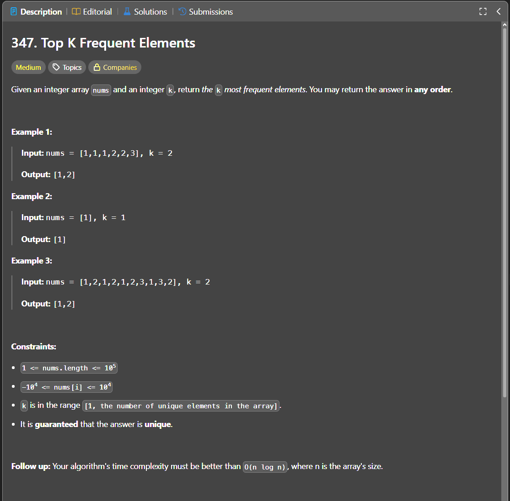

Паттерн: hash map + bucket sort

В этой задаче нужно вернуть `k` самых часто встречающихся элементов.

Идея:

Сначала считаем частоту каждого числа через `map`.

После этого создаём `buckets`, где индекс слайса это частота,
а значение по этому индексу это список чисел с такой частотой.

То есть структура меняется так:

`freq: число -> частота`

в

`buckets: частота -> список чисел`

Пример:

`nums = [10, 10, 10, 20, 20, 30]`

Частоты:

`10 -> 3`
`20 -> 2`
`30 -> 1`

Buckets:

`buckets[1] = [30]`
`buckets[2] = [20]`
`buckets[3] = [10]`

После этого идём по `buckets` с конца, от большей частоты к меньшей,
и добавляем элементы в результат, пока не наберём `k` элементов.

Алгоритм:

1. создаём `map` для подсчёта частот
2. проходим по `nums` и считаем, сколько раз встретилось каждое число
3. создаём `buckets` длиной `len(nums) + 1`
4. проходим по `map`
5. кладём число в bucket с индексом, равным его частоте
6. идём по `buckets` с конца
7. добавляем элементы в результат
8. когда набрали `k` элементов, возвращаем результат

Важно:

`map` в Go не гарантирует порядок обхода.

Это не мешает решению, потому что порядок в `map` не важен.
Мы используем только пару `num -> count`.

Если несколько чисел имеют одинаковую частоту, они попадут в один bucket.
Порядок таких чисел может быть разным, и это нормально.

В тестах для таких случаев лучше сравнивать не порядок, а набор элементов.

Сложность:

Time: O(n)
Space: O(n)

