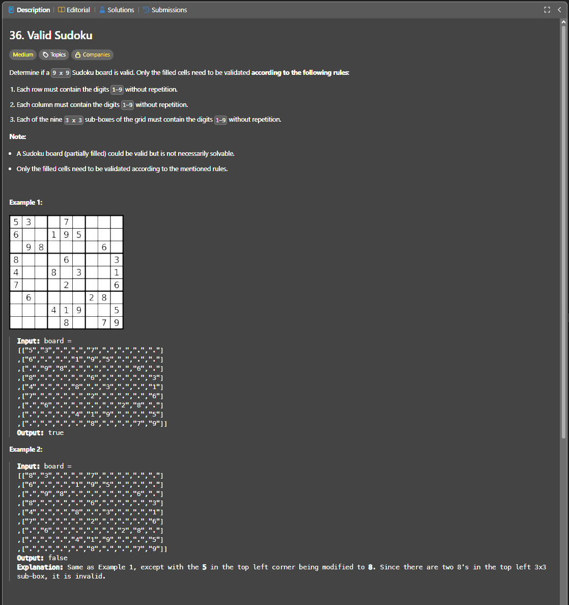

Паттерн: matrix + hash set

В этой задаче не нужно решать судоку полностью.

Нужно только проверить, что уже заполненные клетки не нарушают правила.

Правила:

1. в каждой строке цифры `1-9` не должны повторяться
2. в каждом столбце цифры `1-9` не должны повторяться
3. в каждом квадрате `3x3` цифры `1-9` не должны повторяться

Пустые клетки `.` игнорируются.

Идея:

Проходим по каждой клетке доски `9x9`.

Для каждой цифры проверяем, встречалась ли она уже:

1. в текущей строке
2. в текущем столбце
3. в текущем квадрате `3x3`

Если цифра уже была хотя бы в одном из этих мест, доска невалидна.

Алгоритм:

1. создаём `set` для каждой строки
2. создаём `set` для каждого столбца
3. создаём `set` для каждого квадрата `3x3`
4. проходим по всем клеткам доски
5. если клетка равна `.`, пропускаем её
6. считаем номер квадрата `3x3`
7. проверяем, была ли текущая цифра в строке, столбце или квадрате
8. если была, возвращаем `false`
9. если не была, сохраняем цифру во все три `set`
10. если прошли всю доску без повторов, возвращаем `true`

Номер квадрата `3x3` считается так:

`boxIndex = (row / 3) * 3 + col / 3`

Пример:

`row = 4`, `col = 4`

`boxIndex = (4 / 3) * 3 + 4 / 3 = 1 * 3 + 1 = 4`

Важно:

Задача проверяет только текущее состояние доски.

Она не проверяет, можно ли решить судоку до конца.

Сложность:

Time: O(1)
Space: O(1)

Так как размер доски всегда фиксированный: `9x9`.

Если обобщать на матрицу произвольного размера, то было бы:

Time: O(n²)
Space: O(n²)

